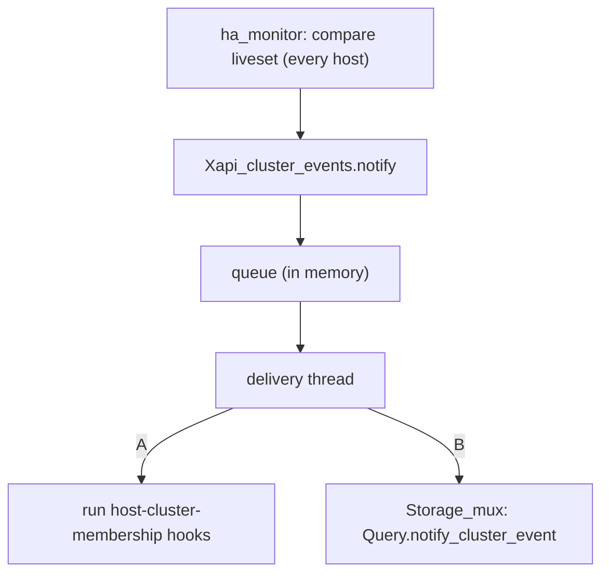

# Introduction

Currently events from cluster are either polled by XAPI (`ha_query_liveset`) each 20s by default, or
XAPI uses a dedicated cluster API `UPDATES.get` that blocks until something happens. Right now the
only consumer of a cluster-stack event today (GFS2/DLM via `dlm_controld`) gets events directly from
the daemon bypassing XAPI entirely. There is no way for a SMAPIv3 plugin to get information from
cluster (e.g. "a host is gone"), without depending on corosync.

The goal of this design is to propose a way for XAPI to forward cluster membership events to SMAPIv3 plugins.
Thus, plugins no longer rely on a particular stack. Only the delivery of events will differ between the
two approaches:

- **A**. Extend the existing XAPI hook scripts so they run on every host
- **B**. Add a new SMAPIv3 call, `Plugin.notify_cluster_event`

This document is a spike. It explores two approaches and gives enough detail to choose one. Only the chosen
approach will be specified further.

# Goals & Non Goals

## Goals

- A SMAPIv3 plugin can be notified that a host has left, or rejoined, the cluster.
- The notification is delivered on **every live host** of the pool, not only the coordinator.
- It still needs to work when the host that disappeared is the coordinator.
- The mechanism is independent of the HA stack used.
- A plugin that doesn't care about cluster events see no change.
- XAPI does not wait for the plugin: notification is asynchronous.

## Non goals

- Replacing DLM for GFS2
- Delivery is best effort and plugins must be idempotent.
- Supporting pools where HA is disabled: HA is a requirement for this mechanism.

# Background

## Cluster stacks

A pool runs at most one active cluster stack (`pool.ha_cluster_stack`). XAPI drives HA
through a set of scripts in `/usr/libexec/xapi/cluster-stack/<stack>/`. We will find for
example:
- `ha_query_liveset`
- `ha_propose_master`
- `ha_start_daemon, ha_stop_daemon`
- `ha_set_pool_state`
- `ha_disarm_fencing`
- `ha_set_excluded`

Two stacks are available: **xha** and **corosync** and both stacks provide these scripts.

- **xha** is the historical HA daemon.
    - It computes group of hosts alive, using heartbeats over the network and the statefile (shared SR).
    - A host that loses the liveset fences itself.
    - It doesn't provide DLM (distributed lock manager) and that is why **corosync** has been introduced.
- **Corosync**:
    - It was introduced mainly to provide DLM support for GFS2.
    - A plugin requests it through the `required_cluster_stack` field of its `query_result`.
    - It uses a new datamodel: _ocaml/idl/datamodel_cluster.ml_.
        - two objects: **Cluster**, **Cluster_host**.
    - XAPI talks to it through `xapi-clusterd` (`Cluster_client.LocalClient`).

## Where XAPI monitors membership changes today

There are several places where a host can be considered gone.

- **HA liveset** (xhad or corosync used as the HA stack)
    - There is a background thread `Xapi_ha.Monitor.ha_monitor` that monitors the membership.
    - All hosts query the liveset `Xapi_ha.Monitor.query_liveset_on_all_hosts`.
    - Only the master acts on dead host.
    - XAPI gets a snapshot of the liveset at each poll (`ha_query_liveset`).
    - The master keeps the previous list (`last_liveset_uuids`) in memory (not in database) and compares it with
      the new one to detect changes.
    - Slaves only check that master is still alived. They keep no list and must not touch the database.
    - Hooks fired: `Xapi_hooks.host_pre_declare_dead` and `Xapi_hooks.host_post_declare_dead`, with reason **fenced**.

- **Corosync membership** (clustering enabled, HA not necessarily)
    - Watcher is `Xapi_clustering.Watcher.watch_cluster_change` and call `on_corosync_update`.
    - Runs on the master only.
    - It updates `Cluster_host.live`, `Cluster.is_quorate`, ... and raises alerts.
    - No hooks fired.

- **On clean shutdown or reboot**
    - `Xapi_host_helpers.mark_host_as_dead` is called when Host is shutdown or rebooted.
    - It is called from `db_gc.ml`.
    - Hooks fired: `Xapi_hooks.host_pre_declare_dead` and `Xapi_hooks.host_post_declare_dead`, with reason **clean-shutdown**.

- **API call**
    - `Xapi_host.declare_dead`
        - Hooks fired: `Xapi_hooks.host_pre_declare_dead` and `Xapi_hooks.host_post_declare_dead`, with reason **user**.
    - `Xapi_host.destroy`
        - Hooks fired: `Xapi_hooks.host_pre_declare_dead` and `Xapi_hooks.host_post_declare_dead`, with reason **dbdestroy**.

We see that today:
- Every existing notification happens on the master only.
- With HA disabled, hooks only fire for planned events (e.g. clean shutdown or reboot), and only on
  the master. A host that crashes or loses connectivity fires no hook.

## XAPI hooks

- `ocaml/xapi/xapi_hooks.ml` runs the executables found in `/etc/xapi.d/<hook-name>/`.
- Hooks are run in lexical order, one after the other.
- XAPI waits for each script to finish.
- Arguments are `-hostuuid <uuid> -reason <reason>`.
- Exit code is 0 (success) or 1 (log and continue), anything else raises `XAPI_HOOK_FAILED`.

## SMAPIv3 plumbing

Here is the path followed by a storage call:
```
xapi (every host)
  -> Storage_mux (queue org.xen.xapi.storage) [ocaml/xapi/storage_mux.ml]
    -> queue org.xen.xapi.storage.<sr-type>  one queue per plugin, not per SR
      -> xapi-storage-script  (daemon that listens [ocaml/xapi-storage-script/main.ml])
         SMAPIv2 call -> SMAPIv3 call -> fork/exec
         /usr/libexec/xapi-storage-script/volume/<plugin>/<Interface.method>
```

- XAPI talks SMAPIv2 (`ocaml/xapi-idl/storage/storage_interface.ml`) to `Storage_mux`.
- `Storage_mux_reg` is a table filled when PBD is plugged. So it only contains the SRs plugged on the host.
- `Storage_mux` looks up the SR in `Storage_mux_reg` to find which queue to use.
- `xapi-storage-script` listens on one queue per plugin directory. It translates the SMAPIv2 call into
  a SMAPIv3 call (`ocaml/xapi-storage/generator/lib/*.ml`).
- It then runs the script named after the SMAPIv3 method in the plugin directory, for example `Plugin.query`
  or `Volume.create`. The arguments go as JSON on stdin, and the result comes back as JSON on stdout.

We can notice that:
- SMAPIv2 has a `Query` module that isn't scoped to an SR. `xapi-storage-script` implements it by calling
  the SMAPIv3 `Plugin.query` and `Plugin.diagnostics`. There is also a `Plugin.ls` but it isn't wired in XAPI.
- Every host runs its own `xapi-storage-script`. So a call made by the local xapi reaches the plugin on the
  same host.

# Event model

The event model is what we tell the plugin. Both approaches carry the same information. Here is
pseudo code to describe it:
```
ClusterEvent {
  kind:   HOST_LEFT    // host no longer in membership, may still be running
        | HOST_FENCED  // host left and is known to be fenced
        | HOST_JOINED   // host is back in the membership
  host: host UUID the event is about
}
```
Then, for each approach we can encode it as:
- **A**: `-event <kind> -hostuuid <host>`
- **B**: a `cluster_event` type in `plugin.ml`

# Overview

1. *Detection*: every host detects membership changes locally.
2. *Queue*: each change is pushed to a queue.
3. *Delivery*: a single thread delivers the events, either with hooks (A) or with a SMAPIv3 call (B).



## Detecting membership changes on every host

XAPI must first detect the change on every host. Today it only does that on the master.
It is the same for both approaches.

### Xhad

- `ha_monitor` already queries the liveset on every host at `ha_monitor_interval`.
- Each host, not only the master, keeps the previous list of live host UUIDs and compares it with the
  new one (see [Implementation details](#implementation-details)).
- This needs no database access, the UUIDs come from the liveset itself.
- The list is in memory, so after a restart of XAPI the list is empty. And the first comparison reports
  every host as joined. So the first comparison after a restart is skipped.

### Corosync

- *TODO*

## A single entry point: notify

All detection points call one function. For example `Xapi_cluster_events.notify ~event`. The caller (for example
the `ha_monitor` loop) must never wait for the delivery, so `notify` delivers the event in the background.
We see two possibilities.

### One thread per event

`notify` creates a new thread that delivers the event:
  - runs the hook for approach A
  - calls the SMAPIv3 plugin for approach B

It logs the result and exits.

**Pros**:
- Simple, no shared state

**Cons**:
- No ordering: two events for the same host run in parallel and can be delivered in the wrong order.
- If a plugin hangs, each new event adds one more blocked thread.

### A single queue

`notify` pushes the event to an in memory queue and returns immediately
(See [Delivery thread](#delivery-thread)).

**Pros**:
- Events are delivered in order
- A hanging plugin delays later events, but no threads pile up.

**Cons**:
- Queue is in memory, so events not yet delivered are lost if XAPI restarts.

One thread per event is enough for a prototype. The queue is the target, because events for a host must be
delivered in order.

## Delivery thread

- It is started with XAPI and lives in a new module `Xapi_cluster_events`.
- It takes events from the queue one by one, in order.
- Each event is delivered with a timeout, so a hanging hook or plugin doesn't block the thread forever.
  The timeout should be configurable from `xapi.conf`.
- What should be the default value for the timeout? same as `ha_monitor_interval`, 20s?
- It only logs errors.
- What "*deliver*" means depends on the approach: see the following A and B sections.

### Approach A: run hooks on every host

#### A new hook

- To keep backward compatibility `host-pre/post-declare-dead` must stay as they are.
- Third-party scripts added there expect to be run on master only and would break if that were not the case.
  As the meaning is different, the new hook indicates a membership change, we introduce a new hook directory
  called `host-cluster-membership`.

#### Running the hook

- If the timeout is reached the script is killed and a log line is written.
- If one script is killed, the other scripts in the directory are still run in lexical order.
- Every host, master and slaves, will execute scripts within `host-cluster-membership` in lexical order (same
  as the other hooks).
- Hooks will be run once per event after a local detection.
- Arguments of the script will be `-event <left|fenced|joined> -hostuuid <uuid>`.
  - See [event model](#event-model).

**Pros**:
- No API change, reuses the existing hook mechanism.
- Any consumer can use it, not only SMAPIv3 plugins.
- Simple to prototype.

**Cons**:
- Not part of the storage API: arguments are untyped and unversioned.
- No link to SRs: the script must find out itself which of its SRs are on the host.
- Plugins must install files in /etc/xapi.d/.

### Approach B: new SMAPIv3 call `Plugin.notify_cluster_event`

It follows the same path as current SMAPIv3 plumbing:
- The cluster events delivery thread (see [Delivery thread](#delivery-thread)) calls a new SMAPIv2
  call `Query.notify_cluster_event`, on the local mux.
- The storage mux calls each SMAPIv3 plugin that has an SR plugged on this host, once per plugin.
- `xapi-storage-script` translates the call to SMAPIv3 `Plugin.notify_cluster_event` and runs the
  script if it exists.
- SMAPIv1 (`storage_smapiv1.ml`) implements the call as a no-op.
- The new call is added in SMAPIv3 IDL (`plugin.ml`).

**Pros**:
- Part of the storage API: typed, documented, versioned.
- Only plugins that provide the script are called.
- Only plugins with an SR plugged on the host are notified.
- Testable with the existing `xapi-storage-script` test harness.

**Cons**:
- More components involved: SMAPIv3 IDL, SMAPIv2 IDL and every SMAPIv2 server (Storage_mux, ...).
- Storage only: other consumers (e.g. monitoring) can't use it.

# Delivery properties

- The script runs on each host with that host's own view.
- An event can be lost if XAPI restarts.
- Hosts are not notified at the same time.
- On a given host, events are delivered in the order they were observed only with the queue option.

# Implementation details

**The monitoring thread**:
- `ocaml/xapi/xapi_ha.ml:ha_monitor` is the thread that monitors the membership set.
- It has some states:
  - `last_liveset_uuids`
  - `last_plan_time`
- It has several helpers:
  - `query_liveset_on_all_hosts`: called on all hosts to query liveset and update statistics.
  - `process_liveset_on_slave`: slaves monitor the master.
  - `uuids_of_liveset`: return the host UUIDs of all nodes in the liveset.
  - `process_liveset_on_master`: master performs VM restart and keeps track of the recovery plan.
- And a main loop. Before entering the main loop master waits for its live slaves (`wait_for_slaves_on_master`).
- The loop:
  - wait `ha_monitor_interval`: it is 20s by default and can be configured.
  - `liveset = query_liveset_on_all_hosts`: it calls the script `ha_query_liveset`
  - if slave -> `process_liveset_on_slave`
  - if master -> `process_liveset_on_master`

**Where to compare liveset for event**:
- In the loop right after the wait, liveset is refreshed by querying the liveset on all hosts. So
  every host has a fresh view of the liveset.
- We can not reuse `last_liveset_uuids` because it is already used by master to detect that something
  happens between the two updates. So if we update it ourselves, the master won't see the change. And
  the `last_liveset_uuids` is not updated in the slave side of the code. So the view won't be correct.
- We can maybe also update `last_liveset_uuids` when processing liveset on slaves. But in the master,
  there is a mechanism where an admin can set `pool.ha_prevent_restarts_for <seconds>`, to stop HA from
  restarting VMs for a while. During that time, the master skips `process_liveset_on_master`. So
  `last_liveset_uuids` is not updated and the same event is repeated at every poll. And a host that comes
  back during the block is never reported as *HOST_JOINED*. Thus, an easier and cleaner solution is to use
  a new dedicated variable that will be updated at every poll, on every host.
- Another point to add a dedicated variable is that the `last_liveset_uuids` is [] by default. So on the
  first poll, the liveset differs and the master sets `plan_out_of_date` to true. The restart plan is
  recomputed and it is fine. For our purpose we don't want to trigger an event. So using `None` will
  allow to distinguish the case where the variable is not set and we won't trigger an unwanted event.

**Call notify for each change**:
- So we think that the best approach is to add a new variable to keep track the liveset UUIDs.
- We then can compare previous and current list and deduce:
  - **fenced** = in previous and not in current
  - **joined** = in current and not in previous
- Note that a host missing from liveset is no longer running anything so even for a clean shutdown we
  can use *HOST_FENCED*.
- For each change, call `Xapi_cluster_events.notify` with the event.

**How to dispatch?**:
- Once notify is called, what happens next depends on the option:
  - `Queue`: notify pushes the event and returns. The delivery thread is already running, since it is started
    with XAPI. It pops event and runs the hook (A) or calls the mux (B).
  - `One thread per event`: notify creates a thread, and that thread runs the hook.
- For approach A, the function that runs hooks is added in `ocaml/xapi/xapi_hooks.ml`.
- For approach B more pieces are involved. See the description below.
- With one thread per event, *notify* uses `Thread.create`.
- The target is the `Queue` but the approach with one thread per event can be a prototype.

**SMAPIv3 details**:
- The delivery calls `Query.notify_cluster_event` through a SMAPIv2 client on the local mux
  (queue *org.xen.xapi.storage*).
- We introduce a new SMAPIv2 IDL (`ocaml/xapi-idl/storage/storage_interface.ml`):
  - Declare the call in `module Query`.
  - Add it to the server signature and to the dispatcher.
  - Add a copy of event type because `xapi-idl` doesn't depend on `xapi-storage`.
- We will need to iterate over `Storage_mux_reg.plugins` to:
  - Keep only `query_result.smapi_version = SMAPIv3`.
  - Group by `query_result.driver`.
  - Call each plugin's `processor` once.
- We will need to modify `xapi-storage-script (main.ml)`:
  - Add `query_notify_cluster_event_impl` in `QueryImpl`, next to `query_diagnostics_impl`.
  - Bind it in `bind`.
  - If the script `Plugin.notify_cluster_event` doesn't exist return `()`.
- In SMAPIv3 IDL (`plugin.ml`):
  - Declare the call.
- Not detailed further unless this approach is chosen.

# Open questions

- What should be the timeout before killing scripts run under `host-cluster-membership`?
- corosync is in *TODO* because we probably won't use it.
- Should we differentiate *HOST_LEFT* vs *HOST_FENCED*?

# Recommendation

We recommend approach A. It is simpler to implement and requires no change to the storage API, which
makes it easier to get accepted. The detection and delivery parts are common to both approaches. So
moving to approach B later would only require replacing the delivery step.
